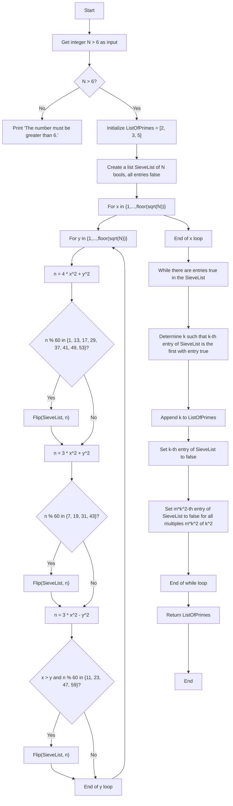

# Sieve of Atkin

The Sieve of Atkin and Bernstein is a modern algorithm to compute the prime numbers smaller than N. In the description below, we follow the Wikipedia Article [SieveOfAtkin](https://en.wikipedia.org/wiki/Sieve_of_Atkin).
We describe the program flow both as text, and graphically.

## Program

### Function Flip(list<bool> SieveList, int n)
* If n <= length(SieveList): Flip the entry: n-th entry of SieveList = not(n-th entry of SieveList).

### Main Program
* Get integer number N > 6 as input.
* Initialize ListOfPrimes = [2, 3, 5].
* Create a list SieveList of N bools, all entries false.
* For x in {1,...,$\mathrm{floor}(\sqrt{N})$}
    + For y in {1,...,$\mathrm{floor}(\sqrt{N)}$}
        - $n = 4 x^2 + y^2$
            * If n mod 60 in {1, 13, 17, 29, 37, 41, 49, 53}: Flip(SieveList, n).
        - $n = 3 x^2 + y^2$
            * If n mod 60 in {7, 19, 31, 43}: Flip(SieveList, n).
        - $n = 3 x^2 - y^2$
            * If x > y and n mod 60 in {11, 23, 47, or 59}: Flip(SieveList, n).
* While there are entries true in the SieveList:
    + Determine k such that: The k-th entry of SieveList is the first with entry true:
        - Append k to ListOfPrimes.
        - Set k-th entry of SieveList to false (we do not want to check it again).
        - Set m*k^2-th entry of SieveList to false for all multiples m*k^2 of k^2 (m = 1,2,...,floor(N/k^2)).
* Return ListOfPrimes.

### Main Program as mermaid.js graph

